Section 3 - Design library cell using Magic Layout and ngspice characterization 
Theory
Implementation
Section 3 tasks:-
Clone custom inverter standard cell design from github repository: Standard cell design and characterization using OpenLANE flow.
Load the custom inverter layout in magic and explore.
Spice extraction of inverter in magic.
Editing the spice model file for analysis through simulation.
Post-layout ngspice simulations.
Find problem in the DRC section of the old magic tech file for the skywater process and fix them.
```bash
1. Clone custom inverter standard cell design from github repository
# Change directory to openlane
cd Desktop/work/tools/openlane_working_dir/openlane

# Clone the repository with custom inverter design
git clone https://github.com/nickson-jose/vsdstdcelldesign
```


```bash
# Change into repository directory
cd vsdstdcelldesign

# Copy magic tech file to the repo directory for easy access
cp /home/vsduser/Desktop/work/tools/openlane_working_dir/pdks/sky130A/libs.tech/magic/sky130A.tech .

# Check contents whether everything is present
ls

# Command to open custom inverter layout in magic
magic -T sky130A.tech sky130_inv.mag &
```
2) Load the custom inverter layout in magic and explore.
custom inverter layout in magic


3) Spice extraction of inverter in magic.
Commands for spice extraction of the custom inverter layout to be used in tkcon window of magic
```bash
# Check current directory
pwd

# Extraction command to extract to .ext format
extract all

# Before converting ext to spice this command enable the parasitic extraction also
ext2spice cthresh 0 rthresh 0

# Converting to ext to spice
ext2spice
```
 tkcon window after running above commands
 

Screenshot of created spice file
 

4) Editing the spice model file for analysis through simulation.
Measuring unit distance in layout grid
  

edited spice file ready for ngspice simulation

  
   
   
5) Post-layout ngspice simulations.
 
Commands for ngspice simulation
```bash
# Command to directly load spice file for simulation to ngspice
ngspice sky130_inv.spice

# Now that we have entered ngspice with the simulation spice file loaded we just have to load the plot
plot y vs time a
```

Screenshots of ngspice run
 
 
 
 Rise Transition Time=t80%​−t20%​
 20% of Output Voltage = 0.2×Vout​=0.66 V
 80% of Output Voltage = 0.8×Vout​=2.64 V
 Rise Time=t(2.64V)−t(0.66V)

 Rise:
 20% 
 
 .
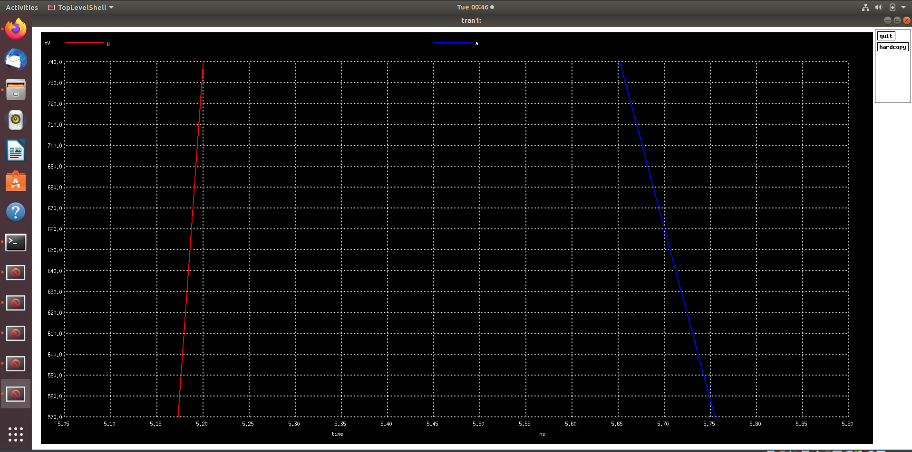.

Rise Transition Time = 5.5193 - 5.1866 = 0.3327 ns

Fall:
80%
  .
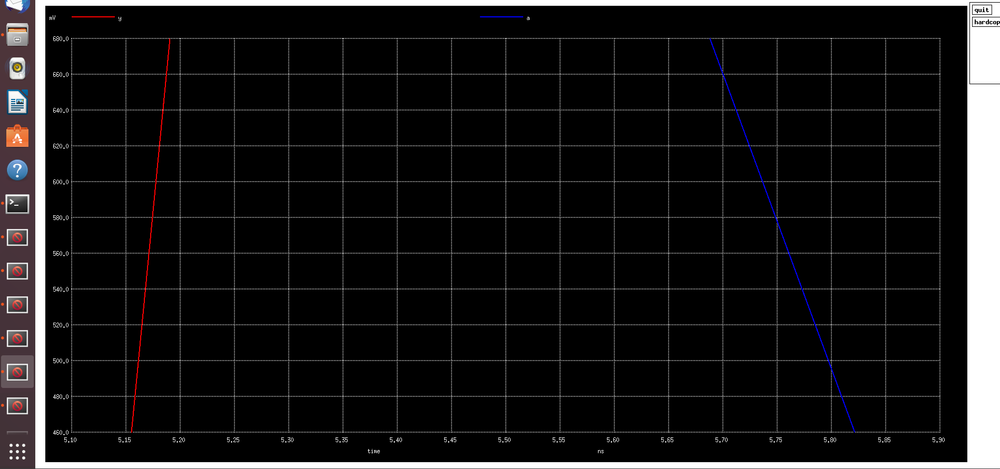.

Fall Transition Time = 5.70097 - 4.50096 = 1.20001 ns

50%
 .
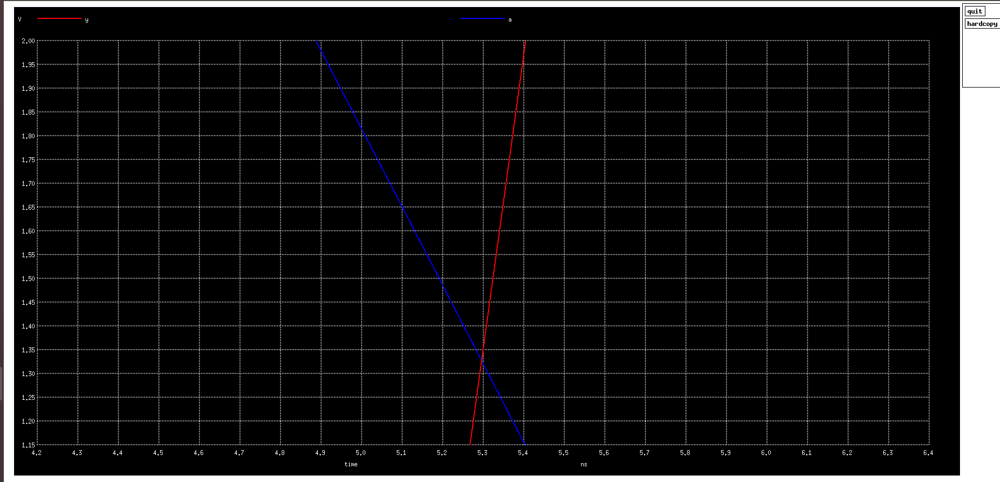

Rise Cell=5.348 - 5.1 = 0.248 ns

6) Find problem in the DRC section of the old magic tech file for the skywater process and fix them.
Link to Sky130 Periphery rules: https://skywater-pdk.readthedocs.io/en/main/rules/periphery.html

Commands to download and view the corrupted skywater process magic tech file and associated files to perform drc corrections
```bash
# Change to home directory
cd

# Command to download the lab files
wget http://opencircuitdesign.com/open_pdks/archive/drc_tests.tgz

# Since lab file is compressed command to extract it
tar xfz drc_tests.tgz

# Change directory into the lab folder
cd drc_tests

# List all files and directories present in the current directory
ls -al

# Command to view .magicrc file
gvim .magicrc

# Command to open magic tool in better graphics
magic -d XR &
```
Screenshots of commands run

 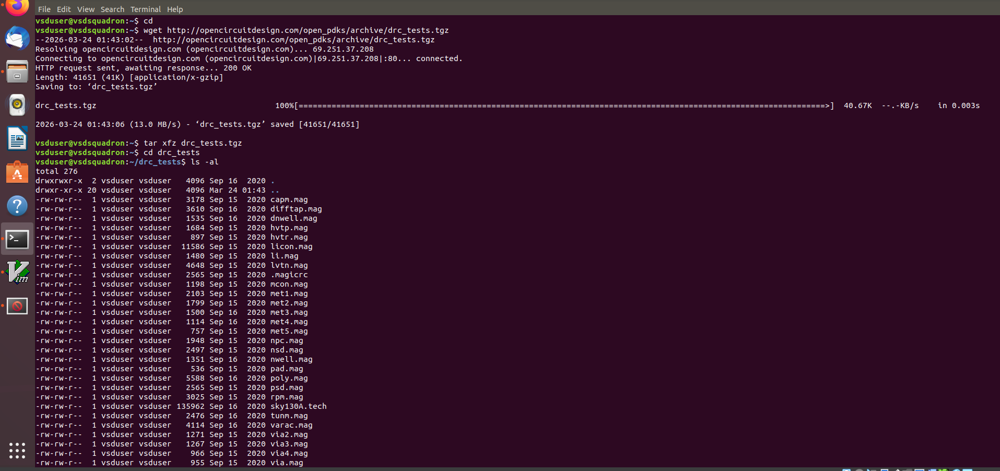.
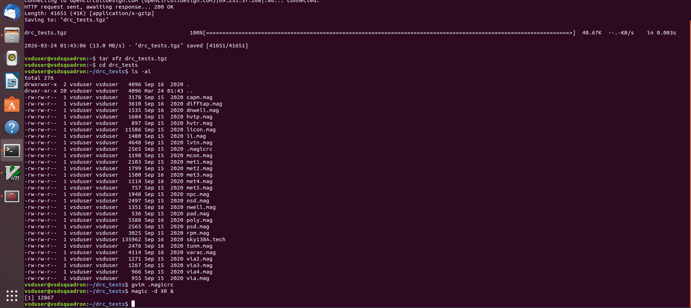
Screenshot of .magicrc file
 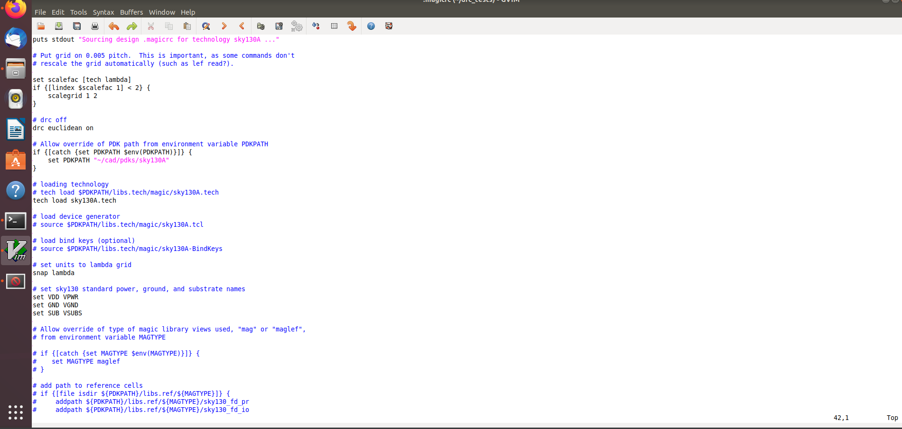.
 Incorrectly implemented poly.9 simple rule correction

Screenshot of poly rules

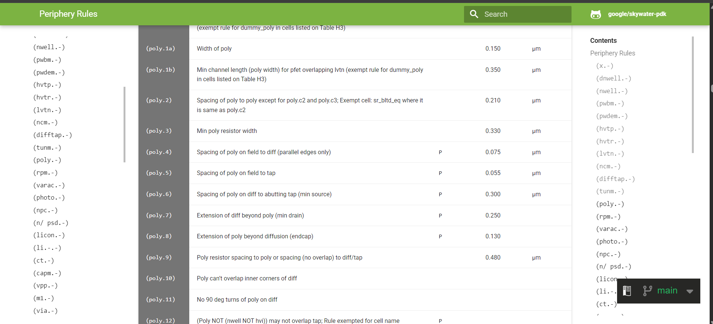

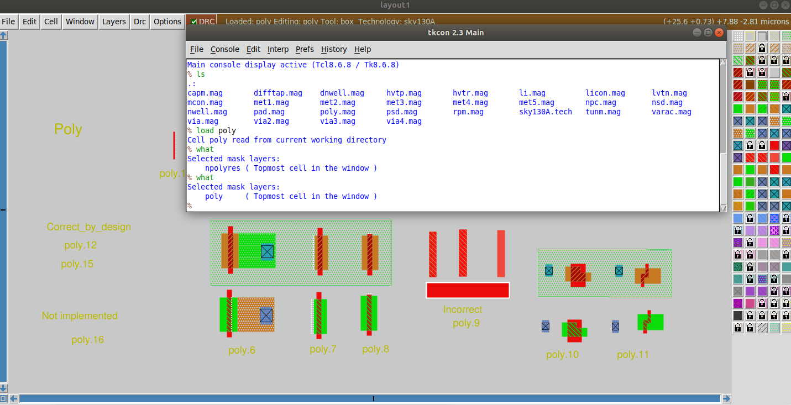

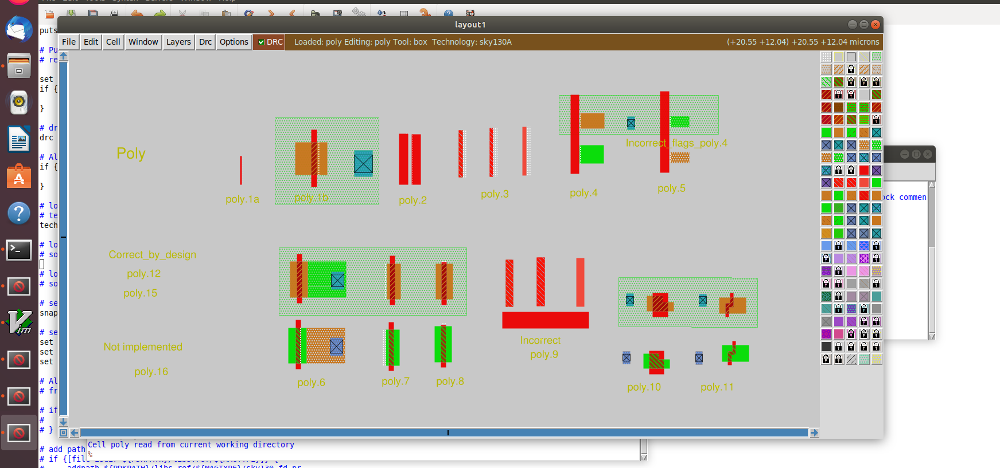

New commands inserted in sky130A.tech file to update drc
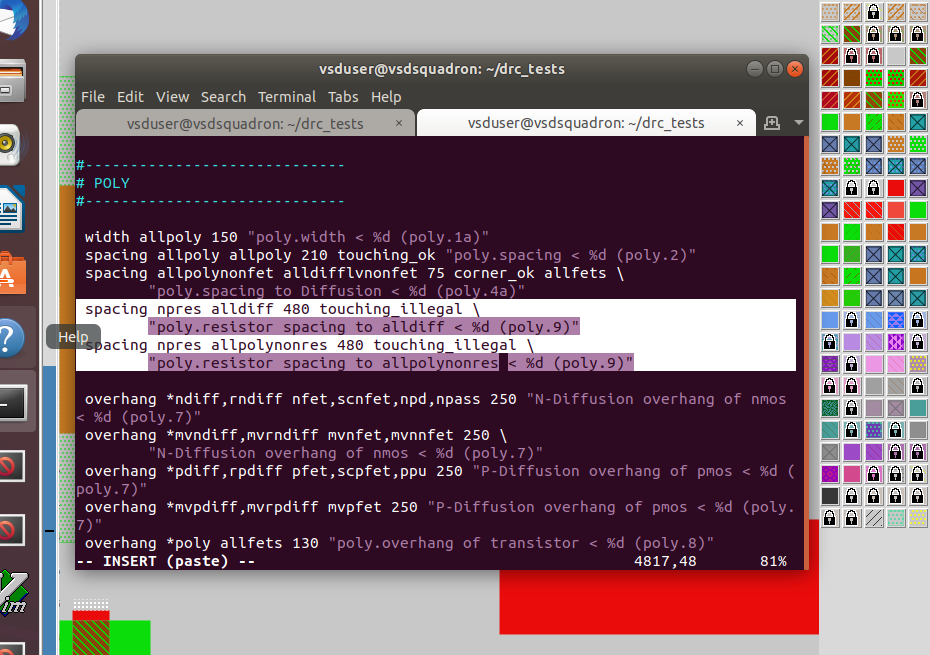
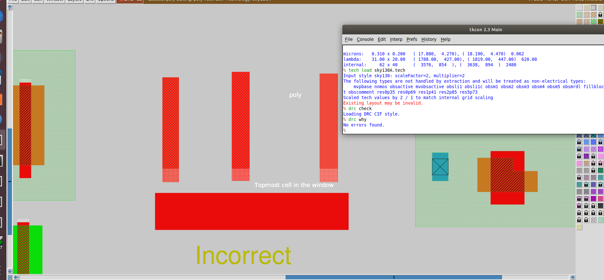

Section 2 – Comparison of Efficient and Inefficient Floorplans & Overview of Standard Cell Libraries 

Conceptual Understanding

Study the characteristics that distinguish a well-optimized floorplan from a poorly structured one.
Gain a basic understanding of standard cell libraries and their role in VLSI design.
Practical Implementation

Execute design steps using the OpenLANE flow and analyze the outputs at different stages.

Section 2 – Assigned Tasks

1)Perform the floorplanning stage for the picorv32a design using the OpenLANE flow and generate the corresponding output files.
2)Extract the dimensions from the generated floorplan DEF file and compute the total die area in micrometers.
3)Import the floorplan DEF file into the Magic layout tool and examine the overall floorplan structure.
4)Execute congestion-aware placement for the picorv32a design using OpenLANE and obtain the resulting outputs.
5)Load the placement DEF file into Magic and analyze the placement distribution and cell arrangement.

Running Floorplanning in OpenLANE

Use the OpenLANE flow commands to initiate and complete the floorplanning stage for the design, ensuring all required outputs are successfully generated.
Section 1 - Inception of open-source EDA, OpenLANE and Sky130 PDK 
Theory
Expand or Collapse
Implementation
Section 1 tasks:-

Run 'picorv32a' design synthesis using OpenLANE flow and generate necessary outputs.
Calculate the flop ratio.
Flop Ratio = No.of D Flipflops/Total Number of Cells
Percentage of DFF's = FlopRatio*100

1. Run 'picorv32a' design synthesis using OpenLANE flow and generate necessary outputs.
Commands to invoke the OpenLANE flow and perform synthesis

```bash
# Change directory to openlane flow directory
cd Desktop/work/tools/openlane_working_dir/openlane

# Start docker
docker
```
```bash
# alias docker='docker run -it -v $(pwd):/openLANE_flow -v $PDK_ROOT:$PDK_ROOT -e PDK_ROOT=$PDK_ROOT -u $(id -u $USER):$(id -g $USER) efabless/openlane:v0.21'
# Since we have aliased the long command to 'docker' we can invoke the OpenLANE flow docker sub-system by just running this command
docker
# Now that we have entered the OpenLANE flow contained docker sub-system we can invoke the OpenLANE flow in the Interactive mode using the following command
./flow.tcl -interactive

# Now that OpenLANE flow is open we have to input the required packages for proper functionality of the OpenLANE flow
package require openlane 0.9

# Now the OpenLANE flow is ready to run any design and initially we have to prep the design creating some necessary files and directories for running a specific design which in our case is 'picorv32a'
prep -design picorv32a

# Now that the design is prepped and ready, we can run synthesis using following command
run_synthesis
```


```bash
# Now we can run floorplan
run_floorplan
```
Screenshot of floorplan run


2) Load generated floorplan def in magic tool and explore the floorplan.
Commands to load floorplan def in magic in another terminal
```bash
# Change directory to path containing generated floorplan def
cd Desktop/work/tools/openlane_working_dir/openlane/designs/picorv32a/runs/17-03_12-06/results/floorplan/
```
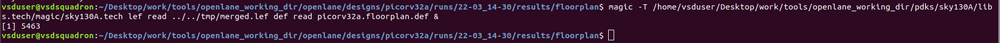
```bash
# Command to load the floorplan def in magic tool
magic -T /home/vsduser/Desktop/work/tools/openlane_working_dir/pdks/sky130A/libs.tech/magic/sky130A.tech lef read ../../tmp/merged.lef def read picorv32a.floorplan.def &
```


Equidistant ports


Port layer 


Before Port distance change


After Setting Port distance 


3) Run 'picorv32a' design congestion aware placement using OpenLANE flow and generate necessary outputs.
Command to run placement
```bash
# Congestion aware placement by default
run_placement
```
Placement run
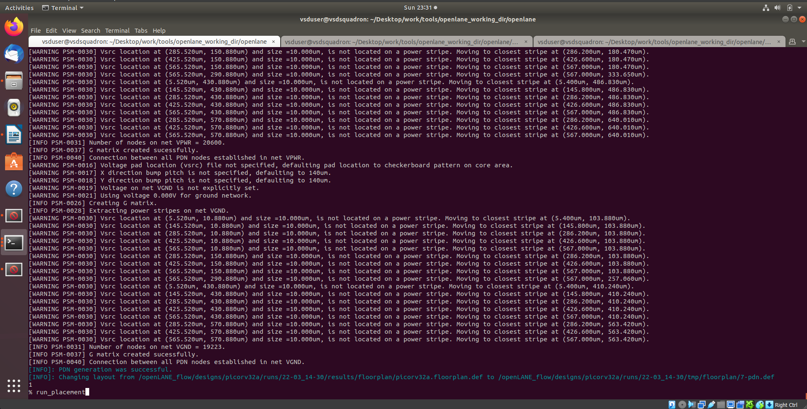

4) Load generated placement def in magic tool and explore the placement.
Commands to load placement def in magic in another terminal
```bash
# Change directory to path containing generated placement def
cd Desktop/work/tools/openlane_working_dir/openlane/designs/picorv32a/runs/17-03_12-06/results/placement/
```
```bash
# Command to load the placement def in magic tool
magic -T /home/vsduser/Desktop/work/tools/openlane_working_dir/pdks/sky130A/libs.tech/magic/sky130A.tech lef read ../../tmp/merged.lef def read picorv32a.placement.def &
```
floorplan def in magic

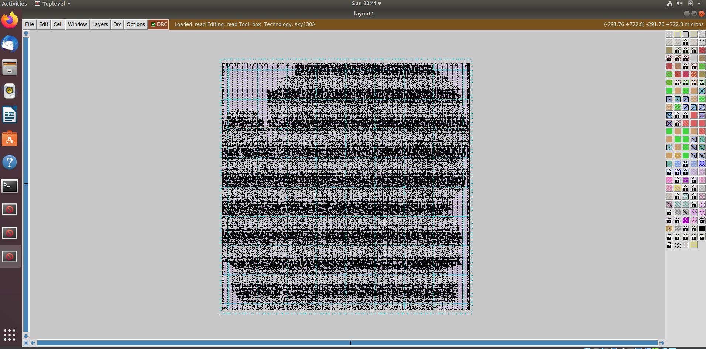
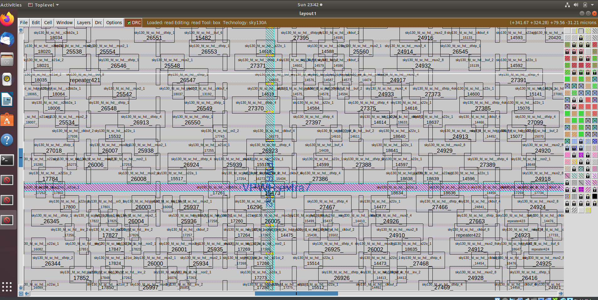

Commands to exit from current run
```bash
# Exit from OpenLANE flow
exit

```

# Exit from OpenLANE flow
exit

# Exit from OpenLANE flow docker sub-system
exit
```

'''


   Flop Ratio = 1613/14876 = 0.10842968539
 
   = 0.10842968539*100 = 10.842968539


# Digital VLSI SoC Design and Planning <br>
This repository documents my hands-on learning of ASIC Physical Design using the OpenLANE flow.<br>
It covers the complete RTL-to-GDSII flow through structured day-wise implementation.


## Objectives:

 -Understand complete ASIC Design Flow <br>
-Gain practical exposure to OpenLANE <br>
-Analyze synthesis, floorplanning, placement, and routing <br>
-Perform timing and design analysis <br>

## Tools & Technologies:
-OpenLANE <br>
-Sky130 PDK <br>
-Docker <br>
-Magic VLSI <br>

## Branches:
->Main Branch <br>
-> Day-1 <br>
-> Day-2 <br>
-> Day-3 
