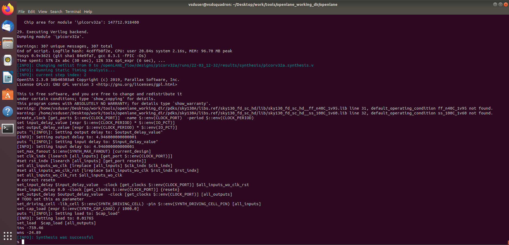
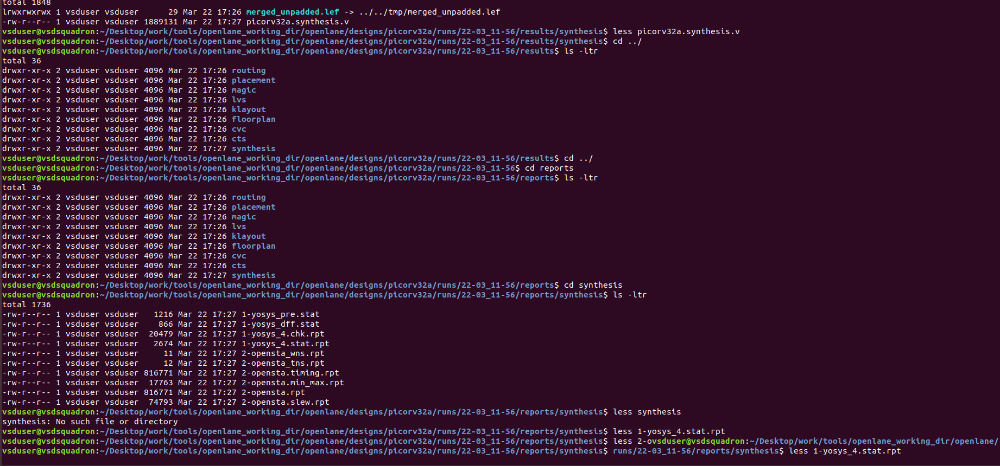
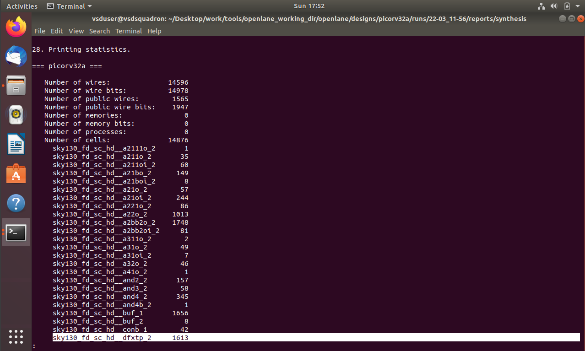

Section 1 - Inception of open-source EDA, OpenLANE and Sky130 PDK (14/03/2024 - 15/03/2024)
Theory
Expand or Collapse
Implementation
Section 1 tasks:-

Run 'picorv32a' design synthesis using OpenLANE flow and generate necessary outputs.
Calculate the flop ratio.
Flop Ratio = No.of D Flipflops/Total Number of Cells
Percentage of DFF's = FlopRatio*100

1. Run 'picorv32a' design synthesis using OpenLANE flow and generate necessary outputs.
Commands to invoke the OpenLANE flow and perform synthesis

```bash
# Change directory to openlane flow directory
cd Desktop/work/tools/openlane_working_dir/openlane

# Start docker
docker
```
```bash
# alias docker='docker run -it -v $(pwd):/openLANE_flow -v $PDK_ROOT:$PDK_ROOT -e PDK_ROOT=$PDK_ROOT -u $(id -u $USER):$(id -g $USER) efabless/openlane:v0.21'
# Since we have aliased the long command to 'docker' we can invoke the OpenLANE flow docker sub-system by just running this command
docker
# Now that we have entered the OpenLANE flow contained docker sub-system we can invoke the OpenLANE flow in the Interactive mode using the following command
./flow.tcl -interactive

# Now that OpenLANE flow is open we have to input the required packages for proper functionality of the OpenLANE flow
package require openlane 0.9

# Now the OpenLANE flow is ready to run any design and initially we have to prep the design creating some necessary files and directories for running a specific design which in our case is 'picorv32a'
prep -design picorv32a

# Now that the design is prepped and ready, we can run synthesis using following command
run_synthesis

# Exit from OpenLANE flow
exit

# Exit from OpenLANE flow docker sub-system
exit
```

'''





   Flop Ratio = 1613/14876 = 0.10842968539
 
   = 0.10842968539*100 = 10.842968539



Section 2 – Comparison of Efficient and Inefficient Floorplans & Overview of Standard Cell Libraries (16/03/2024 – 17/03/2024)
Conceptual Understanding
Study the characteristics that distinguish a well-optimized floorplan from a poorly structured one.
Gain a basic understanding of standard cell libraries and their role in VLSI design.
Practical Implementation
Execute design steps using the OpenLANE flow and analyze the outputs at different stages.
Section 2 – Assigned Tasks
Perform the floorplanning stage for the picorv32a design using the OpenLANE flow and generate the corresponding output files.
Extract the dimensions from the generated floorplan DEF file and compute the total die area in micrometers.
Import the floorplan DEF file into the Magic layout tool and examine the overall floorplan structure.
Execute congestion-aware placement for the picorv32a design using OpenLANE and obtain the resulting outputs.
Load the placement DEF file into Magic and analyze the placement distribution and cell arrangement.
Running Floorplanning in OpenLANE

Use the OpenLANE flow commands to initiate and complete the floorplanning stage for the design, ensuring all required outputs are successfully generated.
```bash
# Change directory to openlane flow directory
cd Desktop/work/tools/openlane_working_dir/openlane

# alias docker='docker run -it -v $(pwd):/openLANE_flow -v $PDK_ROOT:$PDK_ROOT -e PDK_ROOT=$PDK_ROOT -u $(id -u $USER):$(id -g $USER) efabless/openlane:v0.21'
# Since we have aliased the long command to 'docker' we can invoke the OpenLANE flow docker sub-system by just running this command
docker
# Now that we have entered the OpenLANE flow contained docker sub-system we can invoke the OpenLANE flow in the Interactive mode using the following command
./flow.tcl -interactive

# Now that OpenLANE flow is open we have to input the required packages for proper functionality of the OpenLANE flow
package require openlane 0.9

# Now the OpenLANE flow is ready to run any design and initially we have to prep the design creating some necessary files and directories for running a specific design which in our case is 'picorv32a'
prep -design picorv32a

# Now that the design is prepped and ready, we can run synthesis using following command
run_synthesis
```
```bash
# Now we can run floorplan
run_floorplan
```


