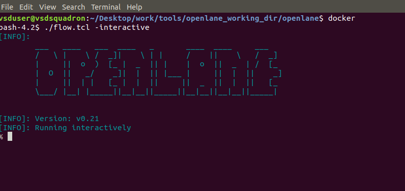

# Digital VLSI SoC Design and Planning  
This repository documents my hands-on learning of ASIC Physical Design using the OpenLANE flow. 
It covers the complete RTL-to-GDSII flow through structured day-wise implementation.

## Objectives:

 -Understand complete ASIC Design Flow  
-Gain practical exposure to OpenLANE  
-Analyze synthesis, floorplanning, placement, and routing  
-Perform timing and design analysis  

## Tools & Technologies:
-OpenLANE  
-Sky130 PDK  
-Docker  
-Magic VLSI  
