Section 3 - Design library cell using Magic Layout and ngspice characterization (18/03/2024 - 21/03/2024)
Theory
Implementation
Section 3 tasks:-
Clone custom inverter standard cell design from github repository: Standard cell design and characterization using OpenLANE flow.
Load the custom inverter layout in magic and explore.
Spice extraction of inverter in magic.
Editing the spice model file for analysis through simulation.
Post-layout ngspice simulations.
Find problem in the DRC section of the old magic tech file for the skywater process and fix them.
```bash
1. Clone custom inverter standard cell design from github repository
# Change directory to openlane
cd Desktop/work/tools/openlane_working_dir/openlane

# Clone the repository with custom inverter design
git clone https://github.com/nickson-jose/vsdstdcelldesign
```
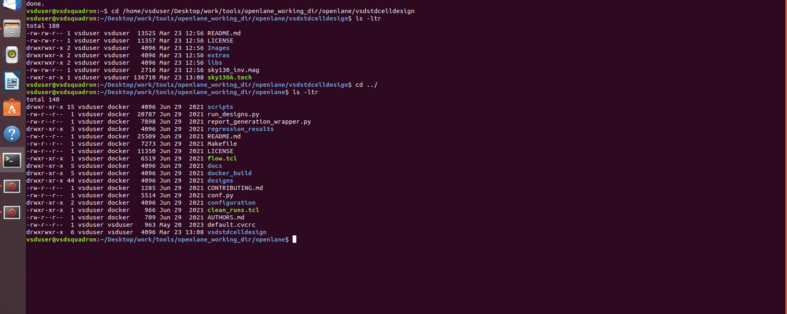

```bash
# Change into repository directory
cd vsdstdcelldesign

# Copy magic tech file to the repo directory for easy access
cp /home/vsduser/Desktop/work/tools/openlane_working_dir/pdks/sky130A/libs.tech/magic/sky130A.tech .

# Check contents whether everything is present
ls

# Command to open custom inverter layout in magic
magic -T sky130A.tech sky130_inv.mag &
```
2) Load the custom inverter layout in magic and explore.
custom inverter layout in magic
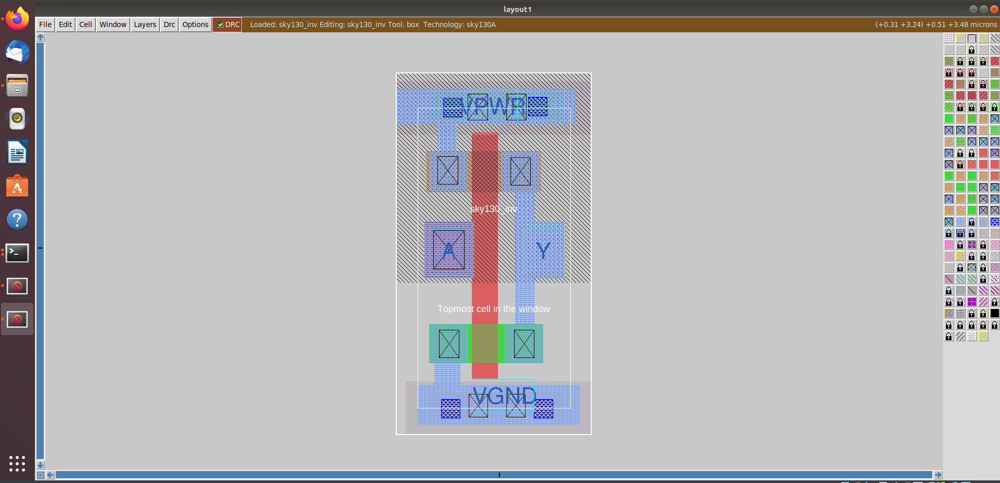
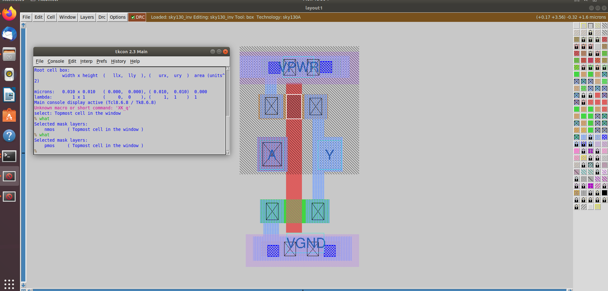
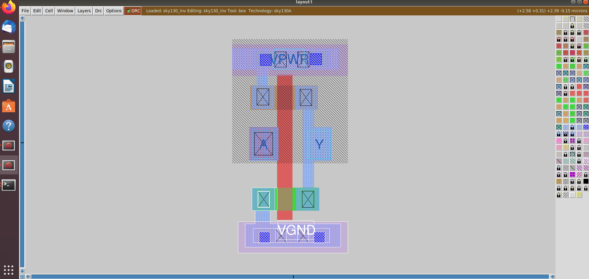
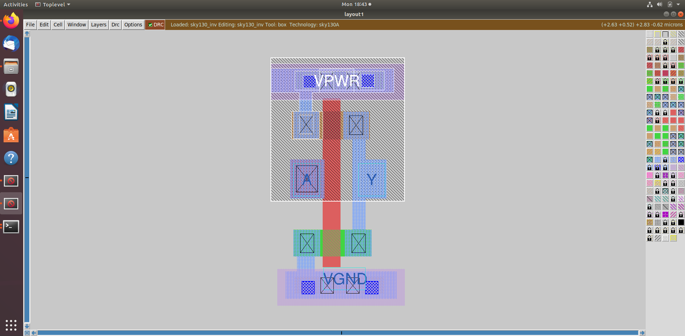

3) Spice extraction of inverter in magic.
Commands for spice extraction of the custom inverter layout to be used in tkcon window of magic
```bash
# Check current directory
pwd

# Extraction command to extract to .ext format
extract all

# Before converting ext to spice this command enable the parasitic extraction also
ext2spice cthresh 0 rthresh 0

# Converting to ext to spice
ext2spice
```
 tkcon window after running above commands
 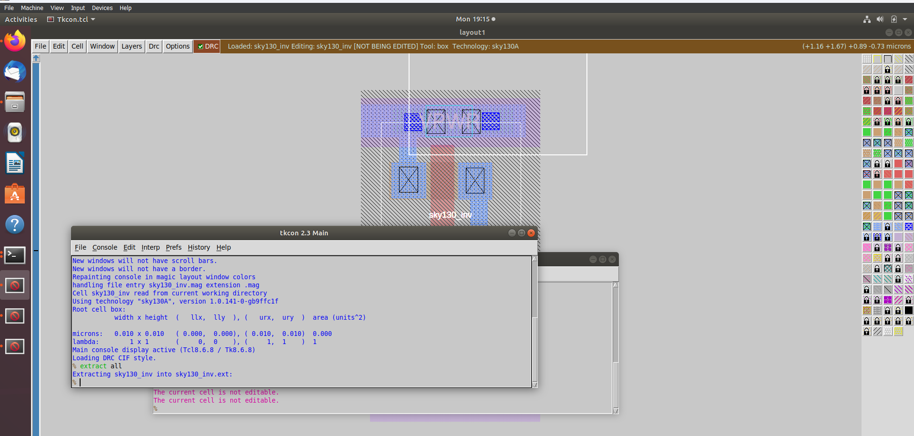
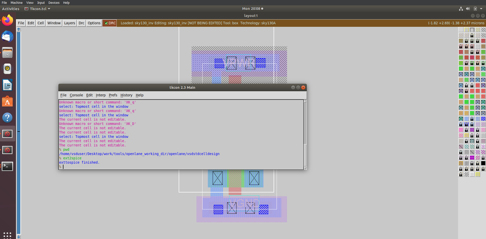
Screenshot of created spice file
 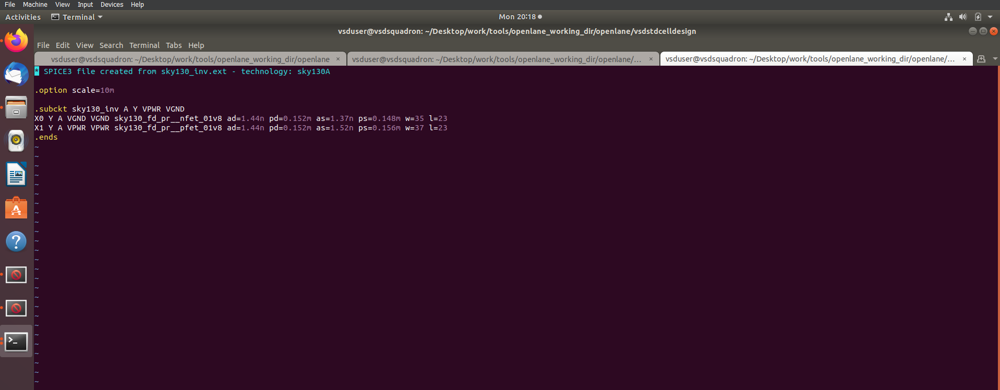

4) Editing the spice model file for analysis through simulation.
Measuring unit distance in layout grid
  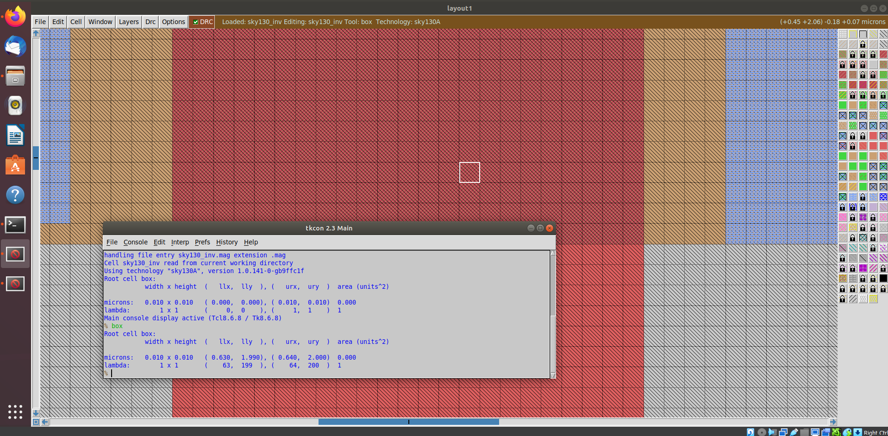

edited spice file ready for ngspice simulation

  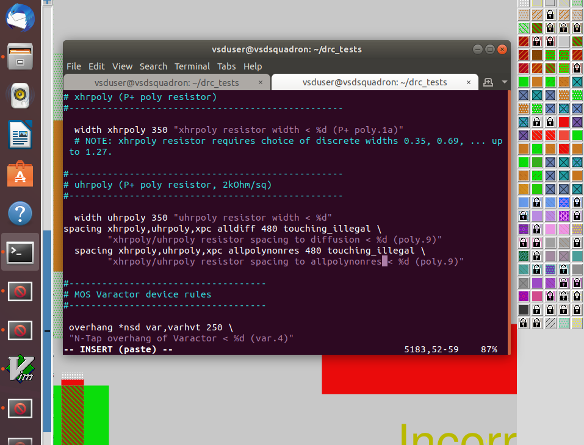
   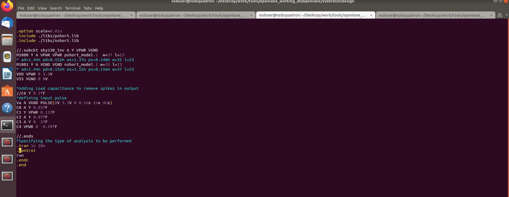
   
5) Post-layout ngspice simulations.
 
Commands for ngspice simulation
```bash
# Command to directly load spice file for simulation to ngspice
ngspice sky130_inv.spice

# Now that we have entered ngspice with the simulation spice file loaded we just have to load the plot
plot y vs time a
```

Screenshots of ngspice run
 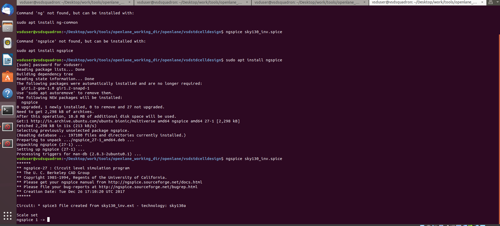
 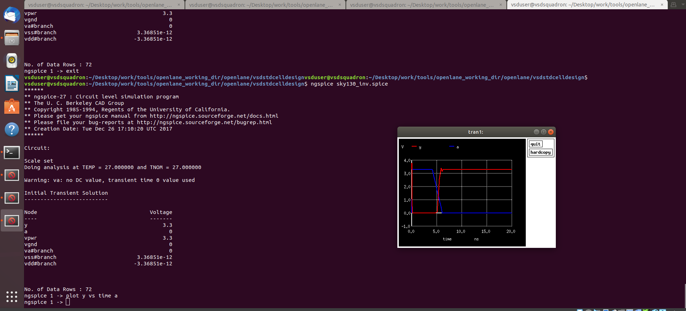
 
 Rise Transition Time=t80%​−t20%​
 20% of Output Voltage = 0.2×Vout​=0.66 V
 80% of Output Voltage = 0.8×Vout​=2.64 V
 Rise Time=t(2.64V)−t(0.66V)

 Rise:
 20% 
 
 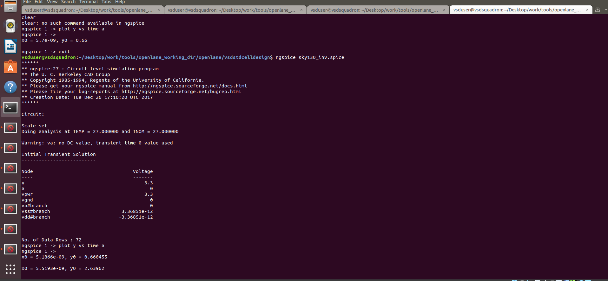
.
Rise Transition Time = 5.5193 - 5.1866 = 0.3327 ns

Fall:
80%
  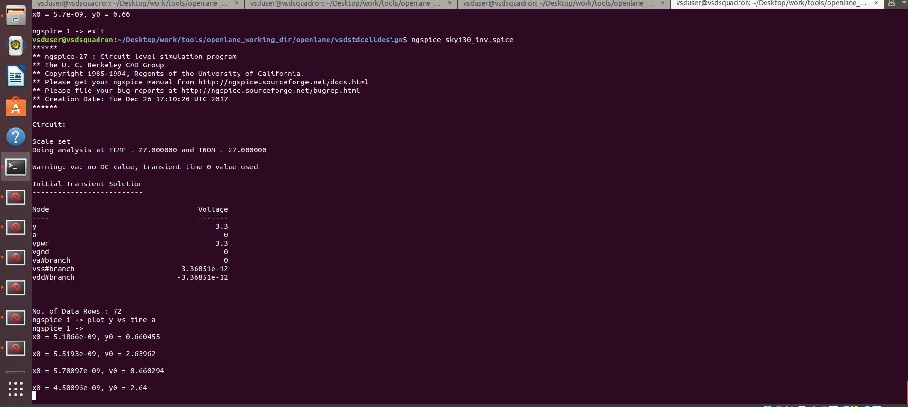
.

Fall Transition Time = 5.70097 - 4.50096 = 1.20001 ns

50%
 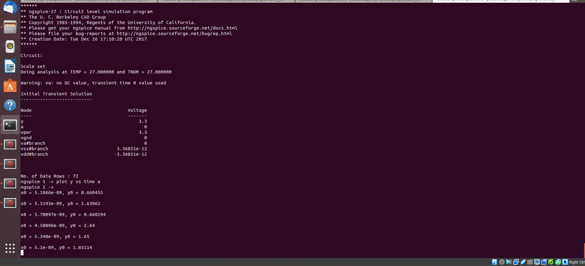
.
